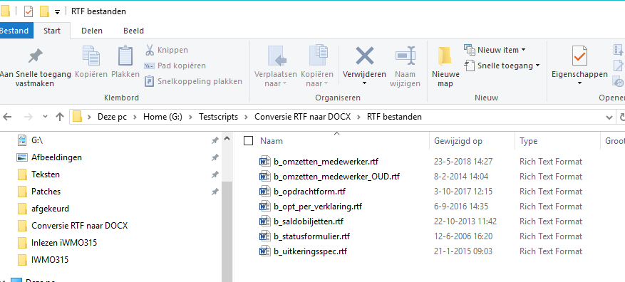
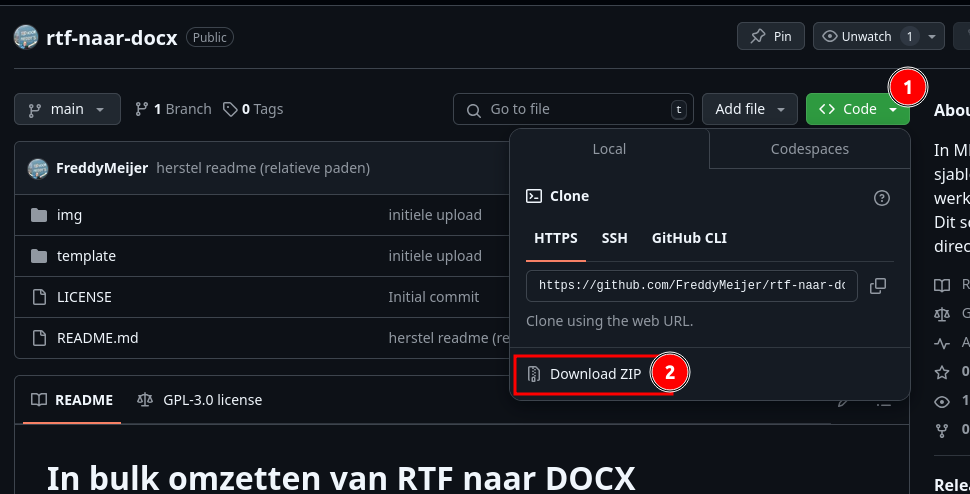
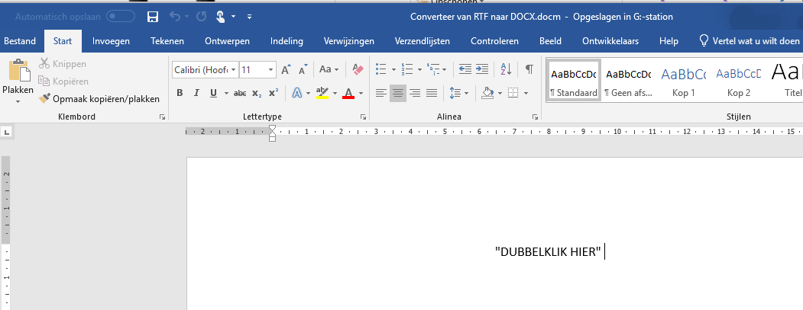
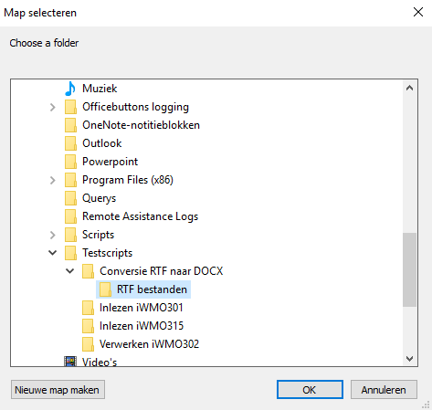
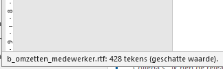
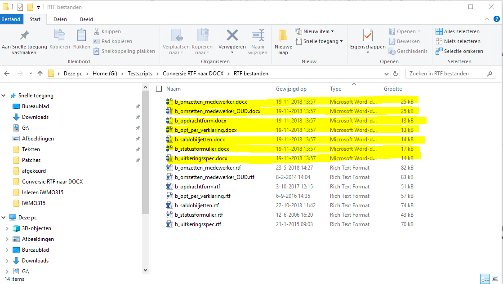

# In bulk omzetten van RTF naar DOCX

In 2018 gaf Centric aan dat het om verschillende redenen verstandig is om van RTF over te stappen naar OOXML (dus DOCX). Nu kan je een RTF bestand openen, opslaan als DOCX en weer sluiten. Dit is niet efficiënt en geeft een risico dat je zo lang bezig bent dat het tijdens productietijd moet. In dat geval loop je kans dat de body al wel omgezet is naar DOCX, maar het sjabloon nog niet. Dit kan gemakkelijker.  

In dit voorbeeld gaan we onderstaande lijst omzetten:



Als je Python draait op jouw systeem, kan je de Python code gebruiken om de omzetting te voltooien. Dit werkt sneller en efficienter dan een Word Visual Basic script. Mocht je Python niet willen of kunnen gebruiken, sla je het volgende hoofdstuk over (Installatie met Python)

1. [Installatie met Python](#installatie-met-python)
2. [Installatie zonder Python](#installatie-zonder-python)
3. [Handleiding](#handleiding)

## Installatie met Python

1. Een installatie van Python is noodzakelijk alvorens de volgende stappen te zetten. Als je geen git hebt, download je deze map en ga verder met stap 3. Als je wel git hebt, dan ga je verder met stap 2.
2. Open een terminal (of gebruik die van Visual Studio Code), navigeer naar de gewenste installatielocatie en gebruik `https://github.com/FreddyMeijer/rtf-naar-docx.git`
3. Open in de terminal de map waarin de repository gekloond is en navigeer naar de map `rtf-naar-docx`.
4. Geef het commando `pip install -r rtf-naar-docx/requirements.txt`
5. Draai `omzetten.py`

### Virtuele omgeving Python

Het wordt aangeraden om de pakketten die nodig zijn om code uit te voeren, te installeren in een virtuele omgeving. Het staat je vrij om dit niet te doen. Als je wel met virtuele omgevingen wilt werken, blijven stappen 1 tot en met 3 onder *Installatie* hetzelfde. We gaan dus verder met 4:

4. In onderstaand code blok maak je eerst een virtuele omgeving aan die je vervolgens activeert (in Windows is dit .\proefrun\Scripts\activate).

```sh
    freddy@laptopfreddy:~/Downloads/PAL21-en-Templafy/rtf-naar-docx$ pip install virtualenv
    freddy@laptopfreddy:~/Downloads/PAL21-en-Templafy/rtf-naar-docx$ python3 -m venv ./omzetten
    freddy@laptopfreddy:~/Downloads/PAL21-en-Templafy/rtf-naar-docx$ source ./omzetten/bin/activate 
    (omzetten) freddy@laptopfreddy:~/Downloads/PAL21-en-Templafy/rtf-naar-docx$ 
```

5. Geef het commando `pip install -r rtf-naar-docx/requirements.txt`
6. Draai `omzetten.py`

## Installatie zonder Python

Er is niet direct een installatie nodig. Het belangrijkste is het templatebestand *Converteer van RTF naar DOCX.docm*. Hiermee kan je aan de slag. Mocht je de code willen aanpassen, vind je in dezelfde map ook de broncode terug (broncode.bas).

Je kan de code downloaden als ZIP bestand. Deze pak je vervolgens uit.



## Handleiding

1. In de map template van deze repository staat het bestand *Converteer van RTF naar DOCX.docm*. Open dit bestand.

2. Dubbelklik op de tekst *DUBBELKLIK HIER*. Zorg er wel voor dat macro's ingeschakeld zijn door op *inhoud inschakelen* te klikken in de waarschuwingsbalk als je die krijgt.

    

3. Ga naar het pad waar de RTF documenten staan die omgezet moeten worden en klik op *OK*

    

4. Wacht rustig af. Onder in het scherm zie je bij welk bestand het systeem is. Als dat scherm verdwijnt is het systeem klaar (er staat nu weer Pagina 1 van 1 en 2 van 2 woorden)

    

In stap 3 heb je een map gekozen waarin de RTF bestanden staan. In diezelfde map zijn nu de DOCX bestanden geplaatst:


